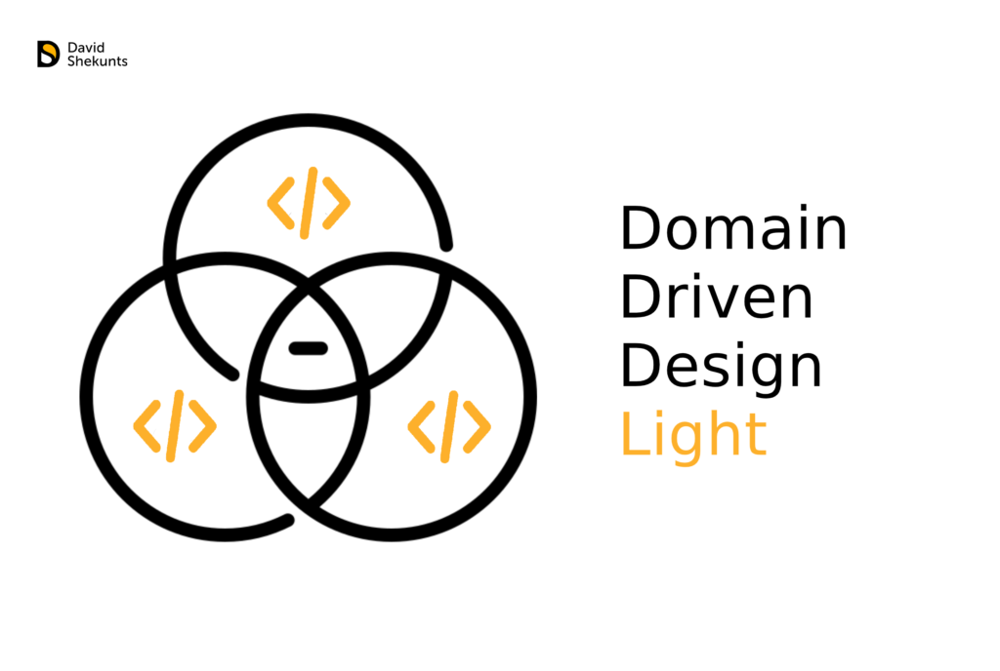
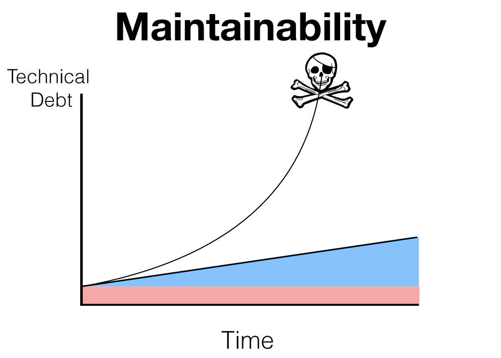

# DDD and DDD Light
DDD and DDD Light - is the experience of the best solutions of many architects and developers,
who faced the same problems due to the growth of their projects.

The main goal of DDD and DDD Light is to reduce the complexity of modifying existing and introducing new functionality
with the growth of the application.

# Difference between DDD Light and DDD

DDD Light (DDDL) removes many of the concepts of standard DDD in favor of speed of development
and faster entry of new team members (both developers and managers) into the process, which
allows you to use it even when writing MVPs.

To be even more precise, DDDL is a set of plug & play concepts. Choose exactly those that you
like, use them for health, learn to apply different concepts for different tasks.

# DDDL components
There are two components: (1) Design and (2) Implementation.

## Design
The main idea of the DDD approach is the ability to quickly penetrate into the context of a
business, communicate effectively and solve business problems.

We will definitely touch upon the topic of analyzing the project and creating from this very
cool and understandable documentation that will be incredibly useful for managers and developers.
And when I speak of documentation, I speak of both text and video materials.

## Implementation
Design patterns and methodologies:

1. `Repository + Query Object + ORM` - as ways to organize access to data sources (databases,
third-party APIs, fs and the like)
1. `Aggregate + Rich Domain Model` - as a way to organize Application Entities and business logic
1. `Domain Features` - as a way to highlight business logic in the context of several Entities
1. `Application Service` - as a convenient way to organize application logic
1. `Service Object` - to maximize SOLID domain logic and application logic
1. `Latent CQRS` - as the rules of what the API can receive and give, and also what kind of
operations can be performed inside the endpoint API
1. `Minimal AOP` - as a convenient way to “stratify” logic and reuse it
1. `Backend for Frontend (BFF)` - as a way to aggregate data for the frontend and make the
frontend more and more dull and the backend more intelligent
1. `Domain and Intergratione Events` - to implement asynchronous operations and reduce logic
connectivity (and also Saga, but more on that later)
1. `Behavior UniT Test Driven Development (BUTTDD)` - check out the name, complete fucking,
but this is an approach to organizing code that is convenient for writing minimal, but most
important tests.

# When DDDL is needed
There are 2 main situations for using DDDL: (1) Enterprise and (2) Maximum Flexibility.

## Enterprise

When you are already big enough (or know that you will become such) and you need to solve scaling
problems.

Again, DDDL is a set of plug & play concepts. Choose those that you like and use for health.
Ready recipes:

1. If you have many data sources (databases, third-party services such as Auth0, Firebase
    , Hasura, partner APIs and so on) – the `Repository + Query Object` link will help you.
1. A sea of ​​complex queries litter your code base? - again take a `Repository` and get a `Query
 Object`
     for free!
1. If you have a lot of input APIs (user, admin and a bunch of other REST APIs, bots, they also
     ask you to screw GraphQL) - then `BFF + Service Object` to help you
1. Tired of a bunch of "pass-through" logic litter the code of operations: validation
    , authorization, logging, transactions, tracing, metrics, .etc? Then you need `AOP`
1. Tired of the mishmash inside the application: it is not clear where it is, a change in one
     place breaks everything else, new developers piss and cry when they see the code - then it's
     time to find out what `Application and Domain logic, Aggregate and Rich Domain Model` are
1. Okay, we pushed everything into the services application logic and domain logic, but the
     application services are simply bold! Then we turn towards `Service Object`
1. Has it become difficult to write data queries? It is unclear how to mix this with business
     logic models. - `CQRS` to the rescue
1. Does the API behave unpredictably? - again `CQRS` to the rescue
1. Already not fit in CRUD? - again `CQRS`
1. To write tests for the endpoint API, you need to raise the HTTP server, database, fixtures
    , Redis, beat your wife, deploy sandbox of third-party services, in short, is it impossible to
    write unit tests? God help you ... And also `BUTTDD`
1. Too long chains of operations, in which a lot of calls to third-party services
    ? - `Integration and Domain Events` will help bring this logic away.
1. etc.

I know it seems complicated. But a close look will notice a branched tree of problems and solutions.
 If you can predict some branch of this tree at the start of the project, then you can immediately lay down these concepts, then you will get the fruits in the form of ready-made solutions. If not, then wait for the rupture of the anus and begin to enter them after.

From the very beginning of any long-term project in any language and framework from an average size,
 I would always use:

`BUTTDD + Service Objects + Rich Domain Model + BFF + Repository + Query Object`

The rest is optional.

## Maximum flexibility
The situation is this: our client is foreign, asks to develop a service that will go for data in
DynamoDB and transfer it to Firestore, so that the client application displays them in real-time, and from Firestore denormalize and put it back into DynamoDB. And since the load is very large and you need speed indefinite scaling, you need to use the serverless architecture on aws lambda.

And I'm afraid that not one MVC Framework is suited for such multi-stacking.

Ok, write without MVC. But how then to structure the logic? Beat layers, make data requests and 
then process them?

**DDD Light helps you easily work with projects that require more flexibility.**

And these principles apply to any language and field of development: from frontend to backend, from 
CRM development to cryptocurrencies and IoT. Therefore, recognizing them once - you become a 
cyberwarrior, capable of writing cool software anytime, anywhere.

# When DDDL is NOT worth using

Firstly, if you have a project that just needs to be done and quickly: an API in a week, an online
store in a month, an internal project in a couple of days - then you do not need DDDL.

Secondly, break your software into modules, and use DDDL only where it is needed:

1. Need authentication? Use Auth0, Cognito, Ory
1. Need content management for a system / application? Uncover some (Headless) CMS.
1. Need an admin? We reveal Django / RoR / Laravel + October CMS / AdminBro / React Admin / Retool
 / Directus
1. Need CRUD / Real-time? Then Firebase, Hasura or some kind of automatic generation library (like
 FeathersJS) is at your service.
1. Do you need a module that will combine all this and turn all this mess into a specific product
 (for example, a distance learning platform)? Voooot here, then we will use DDDL to write 
 high-quality and most flexible software.
 
As you can see, the point-based application of the required technologies allows achieving the 
maximum result from each of them.
 
# What's next?

In the next step, I’ll release the Table of Contents and begin to talk about Entity, UseCase, and
Aggregate from DDD.

News on the release of articles, wait on the Tg channel [@davidshekunts_blog](https://teleg.run/davidshekunts_blog)
