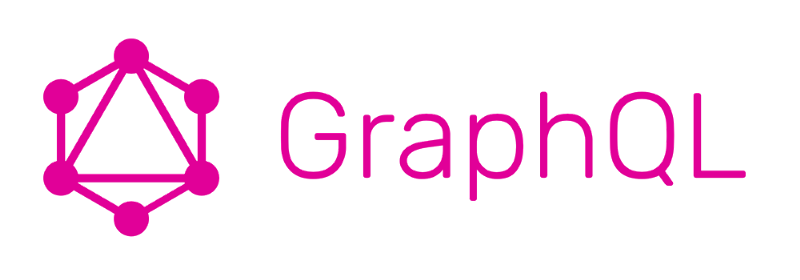

[Rus version of this post](https://davidshekunts.ru/2020/06/08/proekt-bezgolovyj-faq/)

## Whaaat?

You want to give your audience chance to ask you something? But they are to shy to write
 questions in the comment section or directly to you?
 
There is a solution! Headless FAQ!

### Headless Widget

Place widget on your site for people to start asking you questions!

Demo: on the bottom of this page

### Admin panel

Use admin panel to see all questions and give some amazing answers!

### Frontend

Use our already made Frontend with all of your answers!

Demo (ru): [https://faq.davidshekunts.com/](https://faq.davidshekunts.com/)

### Headless Core

The main part of the `Core` is the powerful `GraphQL API`, which allows you to make your own
 widgets, admin and client interfaces that **you** want! Even integrate into the mobile app!

Especially good sync with `SSG` (like `Gatsby.js`) and `Headless CMS` (like `Ghost`)

## 🔥 Free and Open Source 🔥

You can use of all this as an open source!

Link will be placed on this page OR you can follow my github [@dionid](https://github.com/Dionid
) to be noticed of release.

Release will be in July 2020.

## You wanna get Headless FAQ?

You don't have developers, but want Headless FAQ?

You are luky! We can do instead of you, just for 30$.

If you interested in, write me: mail@davidshekints.com or [Telegram](https://teleg.run/davidshekunts)
@davidshekunts

## Tech Spec

What you can find from technical perspective:

### Headless Core
1. **Architecture**
    1. Domain Driven Design Light (DDDL) [(What is it?)](/encyclopedia-domain-driven-design-light-what-is-it-and-why)
    1. Event Driven Architecture (EDA)
    1. CQRS + CQRS bus
    1. Repositories
    1. Modular monolith
    1. IoC + DI
1. **Code**
    1. Telegram Bot
    1. NestJS
    1. GraphQL
    1. Knex
1. **DB**
    1. PostgreSQL
1. **Deploy**
    1. Hasura for DB
    1. Google App Engine for main App
    1. Serverless + Google Cloud Functions
 
### Frontend

1. **UI:** React admin + Material UI
1. **Deploy:** Vercel
1. **API:** GraphQL + Hasura

### You want to create something like this?

Than subscribe to my channel [@davidshekunts_blog](https://teleg.run/davidshekunts_blog) and wait
 till July 2020, when I will start `my new course "F🔥CKING GORGEOUS application on Node.js
  & TypeScript & DDD Light"`

## Created by

David Shekunts with ❤️ ([@dionid](https://github.com/Dionid))