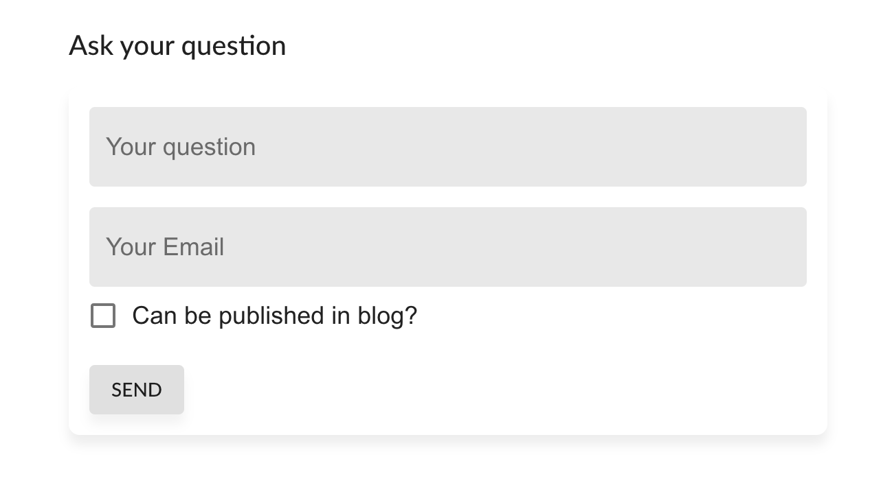
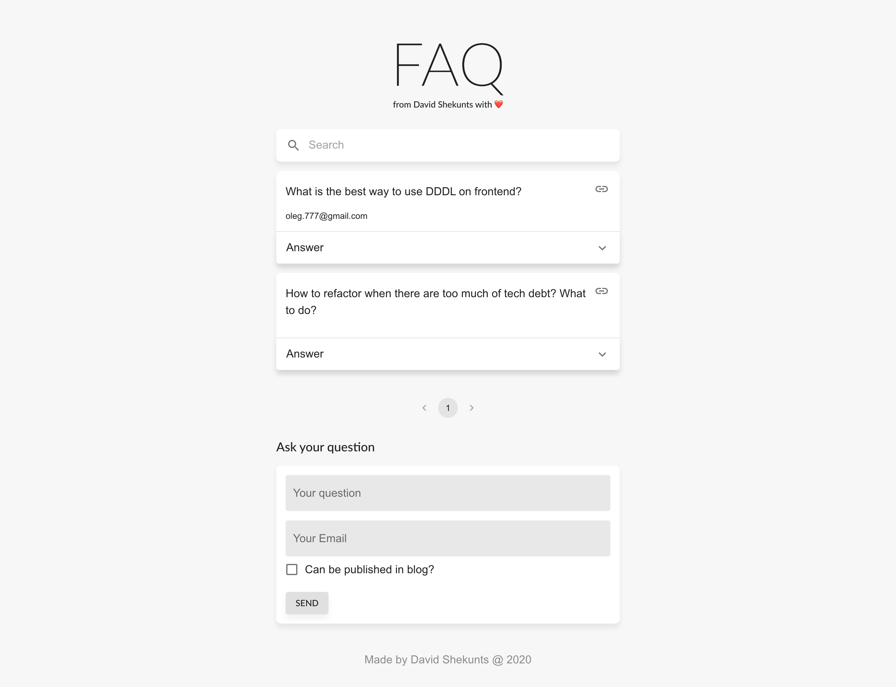

# Whaaat?

You want to give your audience chance to ask you something? But they are to shy to write
 questions in the comment section or directly to you?
 
There is a solution! Headless FAQ!

## Headless Widget

Place widget on your site for people to start asking you questions!

## Admin panel

Use admin panel to see all questions and write answers!

## Frontend

Use our already made Frontend with all of your answers!

Demo (ru): [https://faq.davidshekunts.com/](https://faq.davidshekunts.com/)

## Headless Core

The main part is `Core` – it gives you GraphQL API so you can implement it on any site you want! 

Especially good sync with `SSG` (like `Gatsby.js`) and Headless CMS (like `Ghost`)

# 🔥 Free and Open Source 🔥

You can use of all this as an open source!

Link will be placed on this page OR you can follow my github [@dionid](https://github.com/Dionid
) to be noticed of release.

Release will be in July 2020.

# Tech

What you can find from technical perspective:

## Headless Core
1. **Architecture**
    1. Domain Driven Design Light (DDDL) [(What is it?)](/encyclopedia-domain-driven-design-light-what-is-it-and-why)
    1. Event Driven Architecture (EDA)
    1. CQRS + CQRS bus
    1. Repositories
    1. Modular monolith
    1. IoC + DI
1. **Code**
    1. Telegram Bot
    1. NestJS
    1. GraphQL
    1. Knex
1. **DB**
    1. PostgreSQL
1. **Deploy**
    1. Hasura for DB
    1. Google App Engine for main App
    1. Serverless + Google Cloud Functions
 
## Frontend

1. UI: React admin + Material UI
1. Deploy: Vercel
1. API: GraphQL + Hasura

# Created by

David Shekunts with ❤️ ([@dionid](https://github.com/Dionid))